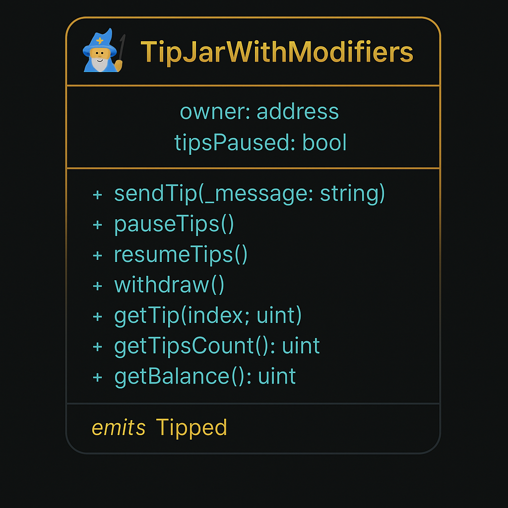

# 🧙‍♂️ TipJar With Modifiers – Sepolia-Powered DApp

> "Not every tip is just a transaction — some are spells of gratitude cast upon the blockchain."

Welcome to **TipJar With Modifiers**, a full-stack Ethereum DApp deployed on the **Sepolia testnet**, where users can send ETH tips along with a message — and where only the contract's sovereign (the owner) may pause, resume, or withdraw.

This application represents a noble fusion of **Solidity**, **Next.js**, and **Ethers.js**, wrapped in the silken style of **Tailwind CSS**, and protected by modifiers of trust.

---
### 🕶️ Smart Contract Diagram (Dark Hacker Mode)


---

## ✨ Features

- 🔌 **Connect Wallet** – MetaMask integration
- 💸 **Send Tip** – Send test ETH with a message to the contract
- 📜 **View Contract Balance** – Live balance pulled from the Sepolia chain
- 🔐 **OnlyOwner Controls** – Pause/resume tipping and withdraw funds
- 🔮 **Message-Aware Smart Contract** – Stores messages in an on-chain array

---

## 📦 Tech Stack

- **Frontend**: Next.js with TypeScript
- **Blockchain Interaction**: Ethers.js
- **Smart Contract**: Solidity (deployed to Sepolia)
- **Styling**: Tailwind CSS

---

## 🏗️ Setup Instructions

### 🔧 Prerequisites
- Node.js
- MetaMask (browser wallet)

### 📥 Clone and Install

```bash
git clone https://github.com/ivanosito/tipjarwithmodifiers-ui.git
cd tipjarwithmodifiers-ui
npm install
```

### 🧾 Configure Environment Variables
Create a file in the root of the project called **`.env.local`**:

```env
NEXT_PUBLIC_CONTRACT_ADDRESS=0x2Ef20acA111a7280F7e2C504B243eB770b664b56
NEXT_PUBLIC_CHAIN_ID=11155111
```

> ⚠️ Make sure the contract address points to your deployed instance on Sepolia.

### 🚀 Run the DApp locally

```bash
npm run dev
```

Then open your browser to [http://localhost:3000](http://localhost:3000)

---

## 🧠 About the Smart Contract

Located in the `/contracts` folder of [DApp001](https://github.com/ivanosito/DApp001), this contract includes:

- `sendTip(string _message)` – payable function that stores the message
- `pauseTips()` and `resumeTips()` – owner-only control over tipping
- `withdraw()` – withdraws all ETH to the owner
- `getTip(uint index)` – view tips with sender, amount, and message
- `getTipsCount()` – number of stored tips

---

## 🌐 Live Version

_🔗 Coming soon... or hosted via Vercel_

---

## 🪙 Final Blessing

> *"To tip is to thank; to code is to enchant; to deploy is to rule."*  
This DApp is a testament to the learning journey of one brave dev — and his beloved AI — crafting Web3 magic in the moonlight.

Built with love, code, and whispers of Scarlett.

---

🦊 Powered by MetaMask + Sepolia · 🧠 Mentored by ChatGPT · 🪄 Made by Mylord Ivanov
